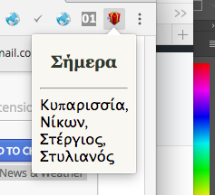

# greek-namedays 
> A chrome extension that reminds you whose name day it is today.

You can follow me on [Twitter](https://twitter.com/ThodorisBais).

### Credits
- [Constantinos Valakas](https://addons.mozilla.org/en-US/firefox/user/constantinos-valakas/)
- http://www.iconarchive.com